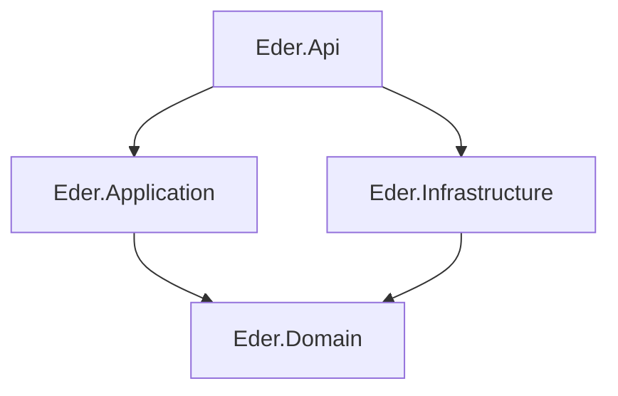

# Eder Management System

Backend ASP.NET Core Web API for tenant and account management with ASP.NET Core Identity-based authentication. Built with clean architecture on **.NET 10**, **PostgreSQL**, and **Entity Framework Core**.

---

## Architecture



| Layer | Project | Responsibility |
|---|---|---|
| Presentation | `Eder.Api` | HTTP host, OpenAPI/Swagger, DI bootstrap |
| Application | `Eder.Application` | DTOs, validators, use cases |
| Domain | `Eder.Domain` | Entities, enums, domain interfaces |
| Infrastructure | `Eder.Infrastructure` | EF Core, Identity, JWT, persistence |

Dependency flow: **Api → Application → Domain** and **Infrastructure → Domain**. The API references Infrastructure only for composition root wiring (`AddInfrastructure()` in `Program.cs`).

---

## Repository layout

```text
.
├── Eder.Api/                    # Program.cs, appsettings, launch profiles
├── Eder.Application/
│   └── Auth/                    # Dtos, Validators
├── Eder.Domain/
│   ├── Entities/                # Account, User, UserLogin, UserRole
│   └── Enums/                   # RoleName, RoleType
├── Eder.Infrastructure/
│   ├── Identity/                # ApplicationUser, ApplicationRole, JwtService
│   ├── Configuration/           # JwtOptions
│   └── Persistence/             # AppDbContext, EF configs, Migrations
├── Eder.slnx
├── docker-compose.local.yml
└── dotnet-tools.json
```

---

## Tech stack

- ASP.NET Core 10 (`net10.0`)
- Entity Framework Core 10 + Npgsql (PostgreSQL)
- ASP.NET Core Identity
- FluentValidation
- Microsoft OpenAPI + Swashbuckle UI
- JWT Bearer (package referenced; middleware not wired yet)

---

## Prerequisites

- [.NET 10 SDK](https://dotnet.microsoft.com/download)
- [Docker](https://www.docker.com/) (optional, for local Postgres and Redis)
- [dotnet EF Core tools](https://learn.microsoft.com/en-us/ef/core/cli/dotnet) (for migrations)

```bash
dotnet tool install --global dotnet-ef
```

Redis is included in `docker-compose.local.yml` but is not used by the application yet.

---

## Getting started

### 1. Clone and enter the repository

```bash
git clone <repository-url>
cd eder-management-system
```

### 2. Start local infrastructure

```bash
docker compose -f docker-compose.local.yml up -d
```

### 3. Create the application database

Docker Compose creates a default `postgres` database. The app expects `eder_db`:

```bash
docker exec -it $(docker ps -qf name=postgres) psql -U postgres -c "CREATE DATABASE eder_db;"
```

### 4. Configure the application

```bash
cp Eder.Api/appsettings.Example.json Eder.Api/appsettings.json
```

Edit `Eder.Api/appsettings.json` with your connection string and JWT secret. This file is gitignored.

Example connection string (matches Docker Compose defaults):

```text
Host=localhost;Port=5432;Database=eder_db;Username=postgres;Password=postgres_password
```

### 5. Restore, build, and migrate

```bash
dotnet restore Eder.slnx
dotnet build Eder.slnx
dotnet ef database update --context AppDbContext --project Eder.Infrastructure --startup-project Eder.Api
```

### 6. Run the API

```bash
dotnet run --project Eder.Api --launch-profile http
```

The API listens on **http://localhost:3000**.

---

## Running the API

Launch profiles are defined in `Eder.Api/Properties/launchSettings.json`.

| Profile | URL | Notes |
|---|---|---|
| `http` | `http://localhost:3000` | Default development profile |
| `https` | `https://localhost:7274` | Also serves HTTP on port 3000; opens Swagger UI |

In **Development** mode:

| Resource | Path |
|---|---|
| OpenAPI document | `/openapi/v1.json` |
| Swagger UI | `/swagger` |

---

## Configuration reference

Settings live in `Eder.Api/appsettings.json` (copy from `appsettings.Example.json`).

| Key | Purpose |
|---|---|
| `ConnectionStrings:DefaultConnection` | PostgreSQL connection string |
| `Jwt:Issuer` | JWT issuer claim |
| `Jwt:Audience` | JWT audience claim |
| `Jwt:SecretKey` | Signing key for access tokens |
| `Jwt:AccessTokenMinutes` | Access token lifetime in minutes |

Override via environment variables:

```bash
export ConnectionStrings__DefaultConnection="Host=localhost;Port=5432;Database=eder_db;Username=postgres;Password=postgres_password"
```

---

## Database and migrations

Migrations are stored in `Eder.Infrastructure/Persistence/Migrations/`.

```bash
# Apply all pending migrations
dotnet ef database update --context AppDbContext --project Eder.Infrastructure --startup-project Eder.Api

# Add a new migration
dotnet ef migrations add <MigrationName> --context AppDbContext --project Eder.Infrastructure --startup-project Eder.Api
```

The initial migration seeds default roles: `ADMIN`, `CHAIR_PERSON`, `SECRETARY`, `TREASURER`, and `USER`.

### Core tables

| Table | Purpose |
|---|---|
| `user_logins` | ASP.NET Identity users (`ApplicationUser`) |
| `user_roles` | ASP.NET Identity roles (`ApplicationRole`) |
| `accounts` | Tenant accounts |
| `users` | Users linked to an account, role, and login |

---

## Current implementation status

### Done

- Clean-architecture solution at repo root
- ASP.NET Core Identity with EF Core persistence
- JWT service registered in DI (`JwtService`)
- Register DTOs and FluentValidation in `Eder.Application`
- OpenAPI and Swagger UI in Development

### Not yet implemented

- Business API endpoints and controllers
- JWT bearer authentication middleware
- Auth use cases (register/login handlers)

---

## Development guide

Where to add new code:

| Adding... | Put it in... |
|---|---|
| New endpoint | `Eder.Api` (controller or minimal API) |
| Request/response models | `Eder.Application/{Feature}/Dtos/` |
| Validation rules | `Eder.Application/{Feature}/Validators/` |
| Business logic | `Eder.Application/{Feature}/` (handlers or services) |
| Domain entity or rule | `Eder.Domain/` |
| DB mapping or external service | `Eder.Infrastructure/` |

Register new Application services in `Eder.Application/DependencyInjection.cs`. Register Infrastructure services in `Eder.Infrastructure/DependencyInjection.cs`.

---

## Tooling

Local .NET tools are declared in `dotnet-tools.json`:

```bash
dotnet tool restore
dotnet csharpier .
```

Use `Eder.Api/Eder.Api.http` for REST client requests in VS Code or Rider.

---

## Troubleshooting

| Problem | Fix |
|---|---|
| Database connection fails | Ensure `eder_db` exists. Compose creates `postgres` by default — see step 3 in Getting started. |
| `Connection string 'DefaultConnection' not found` | Copy `Eder.Api/appsettings.Example.json` to `Eder.Api/appsettings.json`. |
| Migration errors | Confirm Postgres is running (`docker compose ps`) and credentials match your connection string. |
| Swagger not loading | Run with the `https` profile or browse to `/swagger` while `ASPNETCORE_ENVIRONMENT=Development`. |
